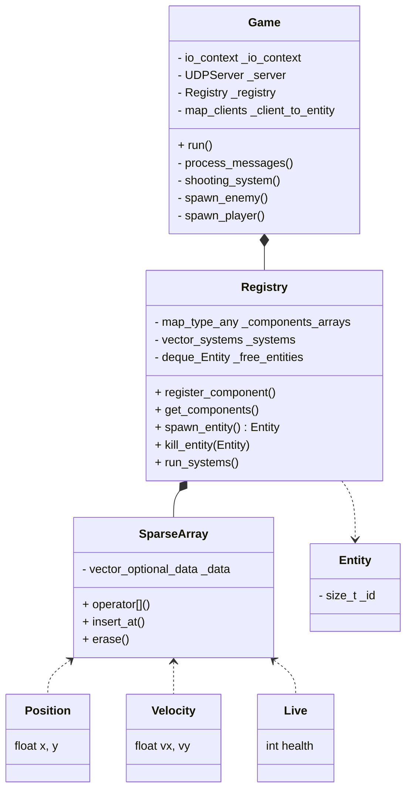
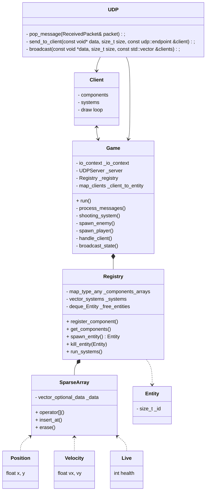

# Meow-Type architecture

## Table of Contents
1. [Introduction](#1-introduction)
2. [General](#2-general)
3. [ECS](#3-ecs)
4. [Network](#4-network)
5. [Client](#5-client)
6. [Conclusio,](#6-conclusion)


## 1. Introduction

Since the Meow-Type project is entirely built in **C++**, and our Engine is working thanks to an **ECS**,
the project's artchitecture is a critical point and must be handled with care.

This documentation explain how we handled architecture, and our vision on it.

We hope that after reading it, you'll better understand how the project works and be able to **contribute** after reading some tutorials :)

## 2. General

The project is built using CMake, we also use CMake CPM to handle third-party librairies.

You will find below the project's tree. As you can see, the project is divided into 3 parts : the **Engine**, that is compiled as a static library that we use on both client and server parts. The engine is an **ECS**, there is some useful links if you need/whant to better understand it:

[Wikipedia article](https://en.wikipedia.org/wiki/Entity_component_system)

[ECS implementation example](https://austinmorlan.com/posts/entity_component_system/)

The ECS contains **generic systems** that we can retrieve in many games (movement, live, collision...).

The **server** has 3 functions :

    - Communicate game's informations to the clients (UDP class)
    - Implement some specific systems (shooting system for example) that are not generics
    - Implement the game loop

The **client** is here to display the game to the user with sprites, musics, menu and settings. It also communicate the user inputs to the server.

The client also use the ECS, for example with a **Drawable** component & system.

The client should **never has authority** on what append on the screen, the server is the only entity who has this power.

```bash
├── CMakeLists.txt
├── README.md
└── src
    ├── client
    │   ├── CMakeLists.txt
    │   └── main.cpp
    │   └── Systems
    │   └── Components
    ├── Engine
    │   ├── CMakeLists.txt
    │   ├── Components
    │   │   └── Components.hpp
    │   ├── Engine.cpp
    │   ├── Entity
    │   │   ├── Entity.hpp
    │   │   ├── Registry.hpp
    │   │   └── SparseArray.hpp
    │   └── Systems
    │       └── Systems.hpp
    └── server
        ├── CMakeLists.txt
        ├── Game.cpp
        ├── include
        │   ├── Game.hpp
        │   ├── Protocol.hpp
        │   └── UDP.hpp
        └── main.cpp

```

## 3. ECS

First, we choose the ECS pattern instead of traditional C++ inheritance for several reasons: 

- **Modularity** : an ECS allows you to choose which component and which system will be applied on your entity, instead of having many classes.
- **Optimisation** : System processes sets of components (data) at once, rather than calling methods on individual objects (as in traditional object-oriented programming).

Let's dive deeper inside our engine. It is divided into four parts :

- The **entity** class: an entity is nothing more than an ID, so it's pretty simple :

```cpp
class Entity {
    public:
        Entity() : _id(0) {}
        explicit Entity(std::size_t id) : _id(id) {}
        operator std::size_t() const {
            return _id;
        }
    private:
        std::size_t _id;
};
```
- The **SparseArray** class : this kind of container works like traditional array (or vector). The main difference is that a value might no be existing at a specific index. This can be quite useful to store components that are defined for most entities, because you don’t have to store the entity ID alongside the component. It is used to store ID's components, using the entity's ID as index.

- The **Registry** class: It's the core of our engine. It use for create/destroy entities, associate components and systems to it thanks to SparseArray, and execute systems.

Here is a diagram for your understand : 



Here is an example on how we use this engine to **make our player move** :

```cpp

struct position {
    float x;
    float y;
};


struct velocity {
    float vx;
    float vy;
};

struct controllable {
    bool is_controlled = true; 
};

void movement_system(registry &r, sparse_array<position> &pos, sparse_array<velocity> &vel)
{
    (void) r;
    for (size_t i = 0; i < pos.size() && i < vel.size(); ++i) {
        if (pos[i] && vel[i]) {
            pos[i]->x += vel[i]->vx;
            pos[i]->y += vel[i]->vy;
        }
    }
}

void Game::create_player(uint16_t clientId, const udp::endpoint &sender)
{
    Entity player = _registry.spawn_entity();
    float startX = 100.0f;
    float startY = 100.0f + (clientId * 50.0f);

    _registry.register_component<position>();
    _registry.register_component<velocity>();
    _registry.add_system<position, velocity>(movement_system);
    _registry.add_component(player, position{startX, startY});
    _registry.add_component(player, velocity{0.0f, 0.0f});
    _registry.add_component(player, controllable{});
}
```

Don't hesitate to read the code to understand deeper how it works.

You're probably now able to manipulate **Entity**, **Components** and **Systems** to add generics comportements to our **Engine**, or specifics systems to our **Game**

## 3. Network

This is the tricky part of the project. Before you read this part, please read the **Network comparative study** and **The protocol doc** on the Wiki.

As a reminder, we choose **Asio** (UDP) for networking and we designed a binary protocol to make the server and client communicate : 

```cpp

namespace rtype::network {

    enum class MessageType : std::uint8_t {
        CLIENT_HELLO      = 0x01,
        SERVER_WELCOME    = 0x02,
        CLIENT_DISCONNECT = 0x03,
        INPUT             = 0x10,
        ENTITY_CREATE     = 0x20,
        ENTITY_UPDATE     = 0x21,
        ENTITY_DESTROY    = 0x22,
        PLAYER_LEFT       = 0x24,
        ENTITY_HIT        = 0x25,
        ENTITY_COLLISION  = 0x26,
    };

    enum class EntityType : std::uint8_t {
        PLAYER         = 1,
        MONSTER        = 2,
        PLAYER_MISSILE = 3,
        ENEMY_MISSILE  = 4,
        OBSTACLE       = 5,
        POWERUP        = 6,
    };

    struct PacketHeader {
        std::uint8_t  type;
        std::uint16_t size;
    };

    struct ClientHello {
        std::uint32_t clientNonce;
        char          name[16];
    };

    struct ServerWelcome {
        std::uint16_t playerId;
    };

    struct ClientDisconnect {
        std::uint16_t playerId;
    };

    struct PlayerLeft {
        std::uint16_t playerId;
    };


    struct Input {
        std::uint16_t playerId;
        std::uint8_t  directionFlags; // 0=UP, 1=DOWN, 2=LEFT, 3=RIGHT
        std::uint8_t  actionFlags;    // 0=FIRE
    };

    struct EntityCreate {
        std::uint16_t entityId;
        std::uint8_t  entityType;
        std::uint16_t x;
        std::uint16_t y;
    };

    struct EntityUpdate {
        std::uint16_t entityId;
        std::uint8_t  entityType;
        std::uint16_t x;
        std::uint16_t y;
    };

    struct EntityDestroy {
        std::uint16_t entityId;
    };

    struct EntityHit {
        std::uint16_t attackerId;
        std::uint16_t targetId;
        std::uint8_t  damage;
        std::uint8_t  remainingHp;
};

    struct EntityCollision {
        std::uint16_t entityA;  
        std::uint16_t entityB;
        std::uint8_t  collisionType;
        std::uint8_t  impactForce;
};

}

```

This protocol is nothing without sending it to the clients, so we designed an UDP class that can broadcast messages :

```cpp
using asio::ip::udp;

struct ReceivedPacket {
    udp::endpoint sender;
    std::vector<char> data;
};

class UDPServer {
public:
    UDPServer(asio::io_context& io_context, short port) : _socket(io_context, udp::endpoint(udp::v4(), port))
    {
        std::cout << "Server listening on port " << port << std::endl;
        start_receive();
    }
    bool pop_message(ReceivedPacket& packet);
    void send_to_client(const void* data, size_t size, const udp::endpoint &client);
    void broadcast(const void *data, size_t size, const std::vector<udp::endpoint> &clients);

private:
    void start_receive();
    void handle_receive(std::error_code ec, std::size_t bytes_recvd);

    udp::socket _socket;
    udp::endpoint _remote_endpoint;
    std::array<char, 1024> _recv_buffer;
    std::queue<ReceivedPacket> _incoming_packets;
};
```

Thanks to this, the game can use it to broadcast the **game state** to the client, which will update inside is own window loop.

Here is the simplified **game loop**, using the UDP class : 

```cpp

void Game::run()
{
    using clock = std::chrono::high_resolution_clock;
    auto last_time = clock::now();
    double accumulator = 0.0;
    const double dt = 1.0 / 60.0; 
    double network_accumulator = 0.0;
    const double network_rate = 1.0 / 60.0;

    while (true) {
        auto current_time = clock::now();
        std::chrono::duration<double> elapsed = current_time - last_time;
        last_time = current_time;
        accumulator += elapsed.count();
        network_accumulator += elapsed.count();
        spawn_timer += elapsed.count();
        _io_context.poll();
        _io_context.restart();
        process_network_messages(); // filter client request (hello ? input ?)

        while (accumulator >= dt) {
            _registry.run_systems();
            accumulator -= dt;
        }
        if (network_accumulator >= network_rate) {
            broadcast_state(); // use the UDP class to broadcast the general state of the game (positions, entity destroy)
            network_accumulator = 0.0;
        }
    }
}

```

Our class diagram now look like this :



## 5. Client

This part is not finished yet.

## 6. Conclusion

Thanks for reading this documentation. We hope that it was useful to you.

If you want to going further, take a look at the *How-to add an ennemy type* and *How to create a plateformer* documentation, that you can found on our Wiki.