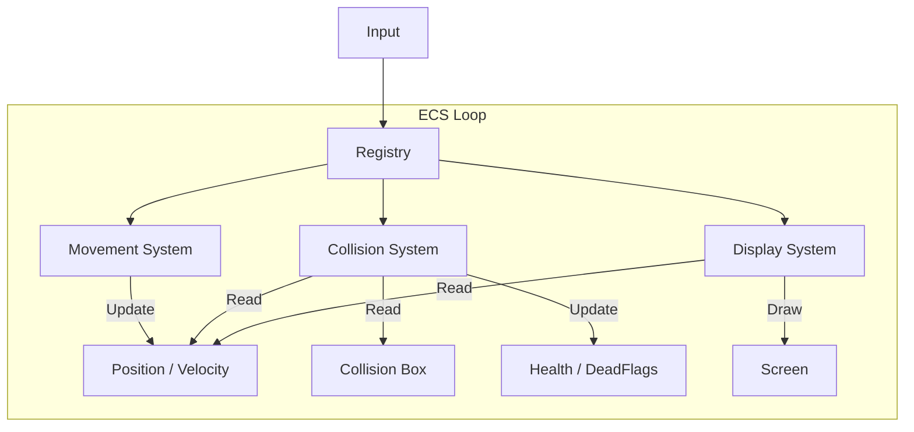

# Technical Documentation : ECS

## Table of Contents
1. [Introduction](#1-introduction)
2. [Why?](#2-why?)
3. [Fundamentals](#3-fundamentals)
4. [Architecture](#4-architecture)
5. [Flow](#5-Flow)
6. [Implementation] (#6-implementation)

## 1. Introduction

As explained in the **Architecture documention**, we use an ECS pattern to manage our entities.

The ECS pattern is mainly used in **video-games development**. Since we're building a game thanks to our own engine, we naturally opted for this pattern.

This documentation explain why we chosse it, how it works and how it materialises in the code.


## 2. Why?

Instead of traditionnal Object-Oriented programming that C++ offer, notably the inheritance, an ECS allow us :

- **Modularity** : instead of having a monster class that inherit from a entity class, where you define a precise comportment for your AI, you give to your monster entity the movement system, the attack system, and the live system. It is easier to add or delete behavior to an entity than the traditionnal inheritance system.

- **Flexibility** : An entity is defined by what it has (data), and not by what it is. It allows a more generics, reusable code.

These are the main reasons why we chose the ECS pattern, but there are others valid reasons to choose it, like the performane (CPU cache).

Our ECS is not really built to be optimized, but if you're interessed in it, take a look at [this article](https://paperwolf.medium.com/understanding-ecs-the-l1-and-l2-cache-and-what-makes-ecs-so-fast-6d0a8f4931dd).

## 3. Fundamentals

### 1. Entity

An entity is nothing more than a **unique identifier** (an ID, often a size_t or uint32_t). It contains **no data, logic, or code**. It is simply a key that allows different components to be linked together.

```cpp
#pragma once

#include <cstddef>

class Entity {
    public:
        Entity() : _id(0) {}
        explicit Entity(std::size_t id) : _id(id) {}
        operator std::size_t() const {
            return _id;
        }
    private:
        std::size_t _id;
};
```

### 2. Component

A component is a **pure data structure**. It contains **no logic** (no complex methods). It is used solely to store the state of a specific aspect of an entity.

We represent component by using structure !

```cpp
struct position {
    float x;
    float y;
};


struct velocity {
    float vx;
    float vy;
};


struct controllable {
    bool is_controlled = true; 
};

struct collision {
    float width;
    float height;
};
```

### 3. Systems

Systems contain all **the game logic**. They have no state of their own (or very little). A system iterates over entities that have a specific set of components to perform actions.

Example with move_system, that check for entities that has a velocity and position component : 

```cpp
void movement_system(registry &r, sparse_array<position> &pos, sparse_array<velocity> &vel)
{
    (void) r;
    for (size_t i = 0; i < pos.size() && i < vel.size(); ++i) {
        if (pos[i] && vel[i]) {
            pos[i]->x += vel[i]->vx;
            pos[i]->y += vel[i]->vy;
        }
    }
}
```

## 4. Architecture

### 1. Sparse Array

Our ECS use a **Sparse Array** to store the components (a sparse array hold only one type of component).

A Sparse Array is nothing more than a *std::vector* wrapper, that allow for **null-indexes** thanks to *std::optionnal*.

This allow to an entity X to have the movement and position system, but being immortal by not having the live component.

### 2. Registry

This the **conductor** of our engine. The registry create and manage entities, hold components containers,
as well as manage systems.

These are the main functions of the registry:

```cpp
 template <class Component>
    sparse_array<Component> &register_component()
    {
        std::type_index type_idx(typeid(Component));
        
        if (_components_arrays.find(type_idx) == _components_arrays.end()) {
            _components_arrays[type_idx] = std::any(sparse_array<Component>{});
            _component_erasers.push_back(
                [](registry &r, Entity const &e) {
                    r.get_components<Component>().erase(e);
                }
            );
        }
        return std::any_cast<sparse_array<Component>&>(_components_arrays[type_idx]);
    }

    Entity spawn_entity()
    {
        if (!_free_entities.empty()) {
            Entity e = _free_entities.front();
            _free_entities.pop_front();
            return e;
        }
        return Entity(_next_entity_id++);
    }


    void kill_entity(Entity const &e)
    {
        
        for (auto &eraser_func : _component_erasers) {
            eraser_func(*this, e);
        }
        _free_entities.push_back(e);
    }

    template <typename Component>
    typename sparse_array<Component>::reference_type add_component(Entity const &to, Component const &c)
    {
        return get_components<Component>().insert_at(to, c);
    }
    
    template <typename Component>
    void remove_component(Entity const &from)
    {
        get_components<Component>().erase(from);
    }

    template <class... Components, typename Function>
    void add_system(Function &&f)
    {
        _systems.push_back([f = std::forward<Function>(f)](registry &r) {
            f(r, r.get_components<Components>()...);
        });
    }

    void run_systems()
    {
        for (auto &sys : _systems) {
            sys(*this);
        }
    }

```

## 5. Flow

Here is the tipical way for calculating a game frame :



## 6. Implementation

Here is a simplified implementation for the move_system :

```cpp
struct Position
{ 
    float x;
    float y; 
};

struct Velocity
{ 
    float vx;
    float vy;
};

void movement_system(registry &r, sparse_array<Position> &pos, sparse_array<Velocity> &vel) 
{
    // iterate on sparse array size
    for (size_t i = 0; i < pos.size() && i < vel.size(); ++i) {
        // check that the entity own the 2 systems
        if (pos[i] && vel[i]) {
            pos[i]->x += vel[i]->vx;
            pos[i]->y += vel[i]->vy;
        }
    }
}

int main(void)
{
    Registry registry;
    
    // register component into sparser array
    registry.register_component<Position>();
    registry.register_component<Velocity>();

    // add the system to the registry, with the sparts arrays
    registry.add_system<Position, Velocity>(movement_system);

    // creation of an entity, we give it the 2 components
    Entity player = registry.spawn_entity();
    registry.add_component(player, Position{0, 0});
    registry.add_component(player, Velocity{1, 1});

    while (true) {
        registry.run_systems(); // this will automatically call the movement_system
    }
}
```

This is a very basic implementation, but an ECS is nothing more than this. Read the code for more tiny details !